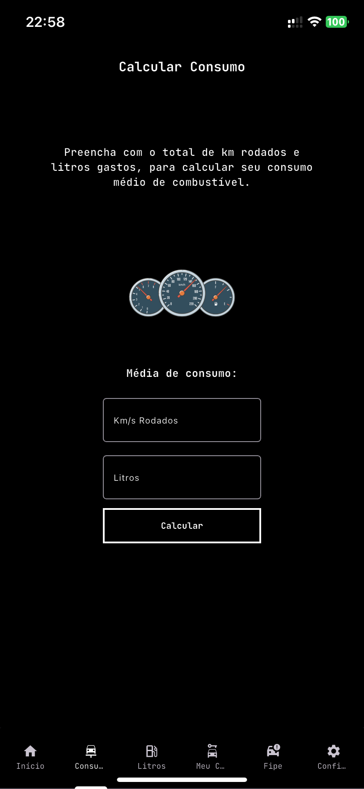
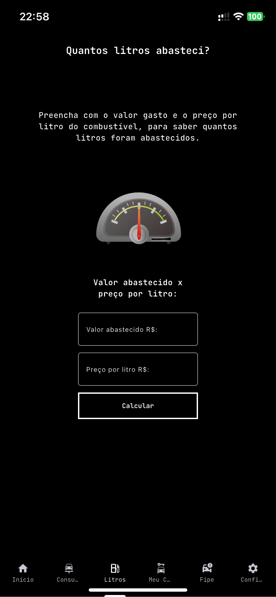
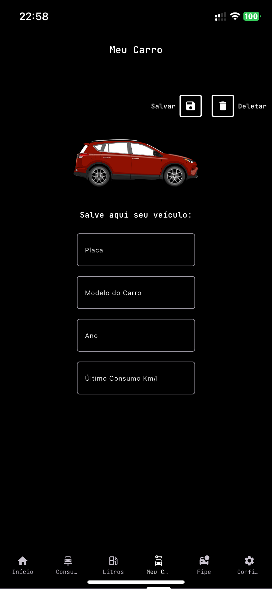
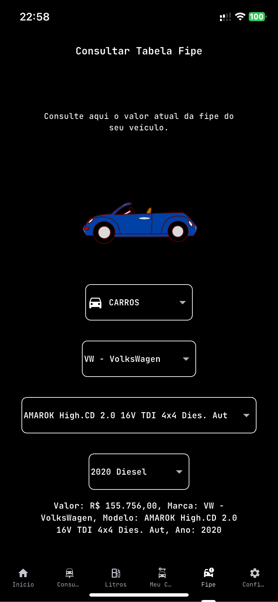
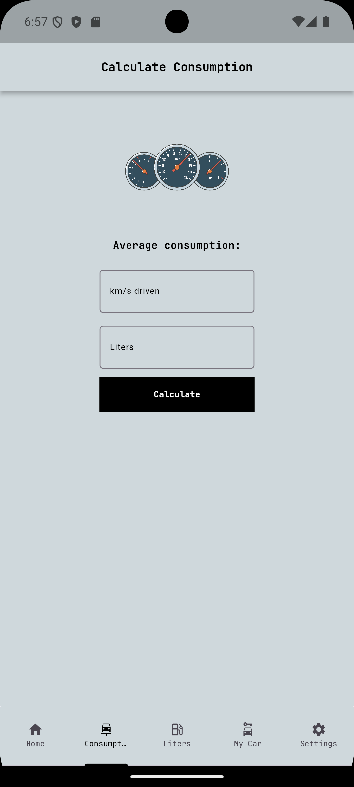

<h1 align="center" id="header">
 Alcohol or Gasoline App Flutter
</h1>

🤖 Stack:

- Dart
- Flutter
- Http dart
- Get Widget UI
- Google Fonts
- Locale Language EN / PT-BR / ES
- Dark Mode Provider
- Flutter local notifications
- Url Launcher
- Timezone

 

⚙️ How to install:

Project Clone

     git clone https://github.com/Victor-Zarzar/alcool_ou_gasolina

Enter in directory:

     cd alcool_ou_gasolina

Open in your favorite editor(e.g. VSCode):

    code .

For install dependencies:

    flutter pub get

Run the app:

    flutter run

### Version iOS:

 &nbsp; &nbsp; &nbsp;  &nbsp; &nbsp; &nbsp;  &nbsp; &nbsp; &nbsp;  &nbsp; &nbsp; &nbsp; 
&nbsp; &nbsp; &nbsp; 

### Version Android:

 &nbsp; &nbsp; &nbsp;  &nbsp; &nbsp; &nbsp; 
